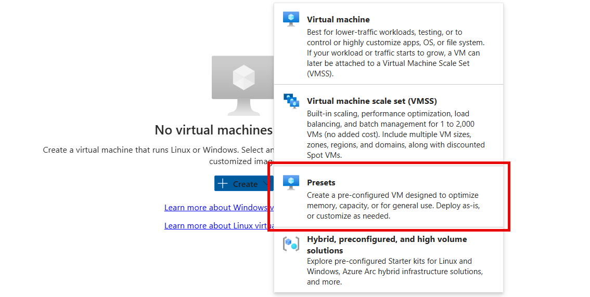

---
lab:
  title: 에이전트 풀 구성 및 파이프라인 스타일 이해
  module: 'Module 02: Implement CI with Azure Pipelines and GitHub Actions'
---

# 에이전트 풀 구성 및 파이프라인 스타일 이해

## 랩 요구 사항

- 이 랩은 **Microsoft Edge** 또는 [Azure DevOps 지원 브라우저](https://docs.microsoft.com/azure/devops/server/compatibility)가 필요합니다.

- **Azure DevOps 조직 설정:** 이 랩에 사용할 수 있는 Azure DevOps 조직이 아직 없으면 [조직 또는 프로젝트 컬렉션 만들기](https://docs.microsoft.com/azure/devops/organizations/accounts/create-organization)에서 제공되는 지침에 따라 조직을 만듭니다.

- [Windows용 Git 다운로드 페이지](https://gitforwindows.org/). 이 랩의 필수 구성 요소로 설치됩니다.

- [Visual Studio Code](https://code.visualstudio.com/) 이 랩의 필수 구성 요소로 설치됩니다.

## 랩 개요

YAML 기반 파이프라인을 사용하면 CD/CI를 코드로 완벽하게 구현할 수 있습니다. 이 구현에서는 파이프라인 정의가 Azure DevOps 프로젝트에 포함된 코드와 같은 리포지토리에 저장됩니다. YAML 기반 파이프라인은 끌어오기 요청, 코드 검토, 기록, 분기, 템플릿 등 클래식 파이프라인에서 제공되는 폭넓은 기능을 지원합니다.

어떤 파이프라인 스타일을 선택하든 Azure Pipelines를 사용하여 솔루션을 배포하거나 코드를 작성하려면 에이전트가 필요합니다. 작업을 한 번에 하나씩 실행하는 에이전트는 컴퓨팅 리소스를 호스트합니다. 작업은 에이전트의 호스트 머신에서 바로 실행할 수도 있고 컨테이너에서 실행할 수도 있습니다. Microsoft에서 호스트하는 에이전트(자동으로 관리됨)를 사용하여 작업을 실행하거나 직접 설정 및 관리하는 자체 호스팅 에이전트를 구현할 수 있습니다.

이 랩에서는 YAML 파이프라인에서 자체 호스팅 에이전트를 구현하고 사용하는 방법을 알아봅니다.

## 목표

이 랩을 완료하면 다음 작업을 수행할 수 있습니다.

- YAML 기반 파이프라인을 구현합니다.
- 자체 호스팅 에이전트를 구현합니다.

## 예상 소요 시간: 30분

## 지침

### 연습 0: (완료된 경우 건너뛰기)랩 필수 구성 요소 구성

이 연습에서는 랩의 필수 구성 요소를 설정합니다. 구체적으로는 [eShopOnWeb](https://github.com/MicrosoftLearning/eShopOnWeb)을 기반으로 하여 새 Azure DevOps 프로젝트와 리포지토리를 설정합니다.

#### 작업 1: (완료된 경우 건너뛰기) 팀 프로젝트 만들기 및 구성

이 작업에서는 여러 랩에서 사용할 **eShopOnWeb** Azure DevOps 프로젝트를 만듭니다.

1. 랩 컴퓨터의 브라우저 창에서 Azure DevOps 조직을 엽니다. **새 프로젝트**를 클릭합니다. 프로젝트 이름을 **eShopOnWeb**으로 설정하고 다른 필드는 기본값으로 유지합니다. **만들기**를 클릭합니다.

#### 작업 2: (완료된 경우 건너뛰기) eShopOnWeb Git 리포지토리 가져오기

이 작업에서는 여러 랩에서 사용할 eShopOnWeb Git 리포지토리를 가져옵니다.

1. 랩 컴퓨터의 브라우저 창에서 Azure DevOps 조직 및 이전에 만든 **eShopOnWeb** 프로젝트를 엽니다. **Repos > 파일**, **리포지토리 가져오기**를 클릭합니다. **가져오기**를 선택합니다. **Git 리포지토리 가져오기** 창에서 다음 URL <https://github.com/MicrosoftLearning/eShopOnWeb.git>을 붙여넣고 **가져오기**를 클릭합니다.

1. 리포지토리는 다음과 같은 방식으로 구성됩니다.
    - **.ado** 폴더에는 Azure DevOps YAML 파이프라인이 포함되어 있습니다.
    - **.devcontainer** 폴더 컨테이너 설정을 통해 컨테이너를 사용하여 개발합니다(VS Code 또는 GitHub Codespaces에서 로컬로).
    - **infra** 폴더에는 일부 랩 시나리오에서 사용되는 코드 템플릿으로 Bicep & ARM 인프라가 포함되어 있습니다.
    - **.github** 폴더에는 YAML GitHub 워크플로 정의가 포함되어 있습니다.
    - **src** 폴더에는 랩 시나리오에서 사용되는 .NET 8 웹 사이트가 포함되어 있습니다.

#### 작업 3: (완료된 경우 건너뛰기) 기본(main) 분기를 기본 분기로 설정

1. **Repos > Branches**로 이동합니다.
1. **기본** 분기를 마우스로 가리킨 다음 열 오른쪽에 있는 줄임표를 클릭합니다.
1. **기본 분기로 설정**을 클릭합니다.

### 연습 1: 에이전트 만들기 및 에이전트 풀 구성

이 연습에서는 Azure VM(가상 머신)을 만들고 이를 사용하여 에이전트를 만들고 에이전트 풀을 구성합니다.

#### 작업 1: Azure VM 만들기 및 연결

1. 브라우저에서 Azure Portal을 엽니다(`https://portal.azure.com`). 메시지가 표시되면 Azure 구독의 소유자 역할이 지정된 계정을 사용하여 로그인합니다.

1. **검색 리소스, 서비스 및 문서(G+/)** 상자에서 **`Virtual Machines`** 을(를) 입력하고 드롭다운 목록에서 선택합니다.

1. **생성** 단추를 선택합니다.

1. **사전 설정 구성을 사용하는 Azure 가상 머신**을 선택합니다.

    

1. 워크로드 환경으로 **개발/테스트**를 선택하고 워크로드 유형으로 **범용**을 선택합니다.

1. **계속 VM 만들기** 단추를 선택하고 **기본 사항** 탭에서 다음 작업을 수행한 다음 **관리**를 선택합니다.

   | 설정 | 작업 |
   | -- | -- |
   | **구독** 드롭다운 목록 | Azure 구독을 선택합니다. |
   | **리소스 그룹** 섹션 | **rg-eshoponweb-agentpool**이라는 새 리소스 그룹을 만듭니다. |
   | **가상 머신 이름** 입력란 | 기본 설정 이름(예: **`eshoponweb-vm`**)을 입력합니다. |
   | **지역** 드롭다운 목록 | 가장 가까운 [Azure](https://azure.microsoft.com/explore/global-infrastructure/geographies) 지역을 선택할 수 있습니다. 예를 들어 'eastus', 'eastasia', 'westus' 등이 있습니다. |
   | **가용성 옵션** 드롭다운 목록 | **인프라 중복이 필요하지 않습니다.** 를 선택합니다. |
   | **보안 유형** 드롭다운 목록 | **신뢰할 수 있는 시작 가상 머신** 옵션을 사용하여 선택합니다. |
   | **이미지** 드롭다운 목록 | **Windows Server 2022 Datacenter: Azure Edition - x64 Gen2** 이미지를 선택합니다. |
   | **크기** 드롭다운 목록 | 테스트 목적으로 가장 저렴한 **표준** 크기를 선택합니다. |
   | **사용자 이름** 입력란 | 기본 설정 사용자 이름 입력 |
   | **암호** 입력란 | 기본 설정 암호 입력 |
   | **퍼블릭 인바운드 포트** 섹션 | **선택한 포트 허용**을 선택합니다. |
   | **인바운드 포트 선택** 드롭다운 목록 | **RDP(3389)** 를 선택합니다. |

1. **관리** 탭의 **ID** 섹션에서 **시스템이 할당한 관리 ID 사용** 체크박스를 선택한 다음 **검토 + 만들기**를 선택합니다.

1. **검토 + 만들기** 탭에서 **만들기**를 선택합니다.

   > **참고**: 프로비저닝 프로세스가 완료될 때까지 기다립니다. 이 작업은 2분 정도 걸립니다.

1. Azure Portal에서 새로 만든 Azure VM의 구성을 표시하는 페이지로 이동합니다.

1. Azure VM 페이지에서 **연결**을 선택하고 드롭다운 메뉴에서 **연결**을 선택한 다음 **RDP 파일 다운로드**를 선택합니다.

1. 다운로드한 RDP 파일을 사용하여 Azure VM에서 실행되는 운영 체제에 대한 원격 데스크톱 세션을 설정합니다.

#### 작업 2: 에이전트 풀 만들기

1. Azure VM에 대한 원격 데스크톱 세션 내에서 Microsoft Edge 웹 브라우저를 시작합니다.

1. 웹 브라우저에서 Azure DevOps 포털(`https://aex.dev.azure.com`)로 이동하고 로그인을 통해 조직에 액세스합니다.

   > **참고**: Azure DevOps 포털에 처음 액세스하는 경우 프로필을 만들어야 할 수 있습니다.

1. **eShopOnWeb** 프로젝트를 열고 왼쪽 아래쪽 메뉴에서 **프로젝트 설정**을 선택합니다.

1. **파이프라인 > 에이전트 풀**에서 **풀 추가** 단추를 선택합니다.

1. **자체 호스팅** 풀 유형을 선택합니다.

1. **eShopOnWebSelfPool**과 같은 에이전트 풀의 이름을 제공하고 선택적 설명을 추가합니다.

1. **모든 파이프라인에 액세스 권한 부여** 옵션을 선택 취소된 상태로 둡니다.

   

   > **참고**: 모든 파이프라인에 대한 액세스 권한을 부여하는 것은 프로덕션 환경에 권장되지 않습니다. 파이프라인의 구성을 간소화하기 위해 이 랩에서만 사용됩니다.

1. **만들기** 단추를 선택하여 에이전트 풀을 만듭니다.

#### 작업 3: 에이전트 설치 파일 다운로드 및 추출

1. Azure DevOps 포털에서 새로 만든 에이전트 풀을 선택한 다음 **에이전트** 탭을 선택합니다.

1. **새 에이전트** 단추를 선택한 다음 새 팝업 창의 **다운로드 에이전트**에서 **다운로드** 단추를 선택합니다.

   > **참고**: 설치 지침에 따라 에이전트를 설치합니다.

1. PowerShell 세션을 시작하고 다음 명령을 실행하여 **에이전트**라는 폴더를 만듭니다.

   ```powershell
   mkdir agent ; cd agent        
   ```

   > **참고**: 에이전트를 설치하려는 폴더(예: C:\agent)에 들어가 있는지 확인합니다.

1. 다음 명령을 실행하여 다운로드한 에이전트 설치 프로그램 파일의 콘텐츠를 추출합니다.

   ```powershell
   Add-Type -AssemblyName System.IO.Compression.FileSystem ; [System.IO.Compression.ZipFile]::ExtractToDirectory("$HOME\Downloads\vsts-agent-win-x64-3.245.0.zip", "$PWD")
   ```

   > **참고**: 에이전트를 다른 위치에 다운로드했거나 다운로드한 버전이 다른 경우 그에 따라 위의 명령을 조정합니다.

#### 작업 4: PAT 토큰 만들기

> **참고**: 에이전트를 구성하기 전에 PAT 토큰을 만들어야 합니다(기존 토큰이 없는 경우). 아래 단계에 따라 PAT 토큰을 만듭니다.

1. Azure VM에 대한 원격 데스크톱 세션 내에서 다른 브라우저 창을 열고, Azure DevOps 포털(`https://aex.dev.azure.com`)로 이동하여 조직 및 프로젝트에 액세스합니다.

1. 사용자의 아바타 아이콘 바로 왼쪽에 있는 오른쪽 상단 메뉴에서 **사용자 설정**을 선택합니다.

1. **개인 액세스 토큰** 메뉴 항목을 선택합니다.

   

1. **새 토큰** 단추를 선택합니다.

1. **eShopOnWebToken**과 같은 토큰의 이름을 제공합니다.

1. 토큰을 사용하려는 Azure DevOps 조직을 선택합니다.

1. 토큰의 만료 날짜를 설정합니다(에이전트를 구성하는 데만 사용됨).

1. 사용자 지정 정의 범위를 선택합니다.

1. 모든 범위 표시를 선택합니다.

1. **에이전트 풀(읽기 및 관리)** 범위를 선택합니다.

1. **만들기** 단추를 선택하여 토큰을 만듭니다.

1. 토큰 값을 복사하여 안전한 장소에 저장합니다(사용자가 다시 볼 수 없습니다. 토큰은 다시 생성만 할 수 있습니다).

   

   > [!IMPORTANT]
   > 에이전트 구성 전용의 최소 권한 옵션인 **에이전트 풀(읽기 및 관리)** 을 사용합니다. 또한 그것이 토큰의 유일한 목적인 경우 토큰에 대한 최소 만료 날짜를 설정해야 합니다. 에이전트를 다시 구성해야 하는 경우 동일한 권한으로 다른 토큰을 만들 수 있습니다.

#### 작업 5: 에이전트 구성

1. Azure VM에 대한 원격 데스크톱 세션 내에서 PowerShell 창으로 다시 전환합니다. 필요한 경우 현재 디렉터리를 이 연습의 앞부분에서 에이전트 설치 파일을 추출한 디렉터리로 변경합니다.

1. 에이전트가 무인으로 실행되도록 구성하려면 다음 명령을 호출합니다.

   ```powershell
   .\config.cmd
   ```

   > **참고**: 에이전트를 대화형으로 실행하려면 대신 `.\run.cmd`를 사용합니다.

1. 에이전트를 구성하려면 메시지가 표시된 후 다음 작업을 수행합니다.

   - Azure DevOps 조직의 URL(**서버 URL**)을 `https://aex.dev.azure.com`{조직 이름} 형식으로 입력합니다.
   - 기본 인증 유형(**`PAT`**)을 적용합니다.
   - 이전 단계에서 만든 PAT 토큰 값을 입력합니다.
   - 이 연습의 앞부분에서 만든 에이전트 풀 이름(**`eShopOnWebSelfPool`**)을 입력합니다.
   - 에이전트 이름(**`eShopOnWebSelfAgent`**)을 입력합니다.
   - 기본 에이전트 작업 폴더(_work)를 수락합니다.
   - **Y**를 입력하여 에이전트가 서비스로 실행되도록 구성합니다.
   - 에이전트 서비스에 SERVICE_SID_TYPE_UNRESTRICTED를 사용하도록 설정하려면 **Y**를 입력합니다.
   - **NT AUTHORITY\SYSTEM**을 입력하여 서비스에 대한 보안 컨텍스트를 설정합니다.

   > [!IMPORTANT]
   > 일반적으로 서비스 보안 컨텍스트를 구성할 때 최소 권한 원칙을 따라야 합니다.

   - 구성이 완료된 직후 서비스를 시작할 수 있도록 하려면 기본 옵션(**N**)을 수락합니다.

   

   > **참고**: 에이전트 구성 프로세스를 완료하는 데 몇 분 정도 걸립니다. 완료되면 에이전트가 서비스로 실행 중임을 나타내는 메시지가 표시됩니다.

   > [!IMPORTANT] 에이전트가 실행되고 있지 않음을 나타내는 오류 메시지가 표시되면 서비스를 수동으로 시작해야 할 수 있습니다. 이렇게 하려면 Windows 제어판에서 **서비스** 애플릿을 열고 **Azure DevOps 에이전트(eShopOnWebSelfAgent)** 라는 서비스를 찾아 시작합니다.

   > [!IMPORTANT] 에이전트를 시작하지 못하는 경우 에이전트 작업 디렉터리에 대해 다른 폴더를 선택해야 할 수 있습니다. 이렇게 하려면 에이전트 구성 스크립트를 다시 실행하고 다른 폴더를 선택합니다.

1. Azure DevOps 포털을 표시하는 웹 브라우저로 전환하고, 에이전트 풀로 이동한 후 **에이전트** 탭을 클릭하여 에이전트 상태를 확인합니다. 목록에 새 에이전트가 표시됩니다.

   

   > **참고**: Windows 에이전트에 대한 자세한 내용은 [자체 호스팅 Windows 에이전트](https://learn.microsoft.com/azure/devops/pipelines/agents/windows-agent)를 참조하세요.

   > [!IMPORTANT]
   > 에이전트가 Azure DevOps 파이프라인에서 Azure 리소스를 빌드하고 배포할 수 있게 하려면(향후 랩에서 단계별 실행) 에이전트를 호스팅하는 Azure VM의 운영 체제 내에 Azure CLI를 설치해야 합니다.

1. 웹 브라우저를 시작하고 [Windows에 Azure CLI 설치](https://learn.microsoft.com/cli/azure/install-azure-cli-windows?tabs=azure-cli#install-or-update) 페이지로 이동합니다.

1. Azure CLI 다운로드 및 설치.

1. (선택 사항) 원하는 경우 다음 PowerShell 명령을 실행하여 Azure CLI를 설치합니다.

   ```powershell
   $ProgressPreference = 'SilentlyContinue'; Invoke-WebRequest -Uri https://aka.ms/installazurecliwindows -OutFile .\AzureCLI.msi; Start-Process msiexec.exe -Wait -ArgumentList '/I AzureCLI.msi /quiet'; Remove-Item .\AzureCLI.msi
   ```

   > **참고**: 다른 버전의 Azure CLI를 사용하는 경우 그에 따라 위의 명령을 조정해야 할 수 있습니다.

1. 웹 브라우저에서 Microsoft .NET 8.0 SDK 설치 프로그램 페이지(`https://dotnet.microsoft.com/en-us/download/dotnet/thank-you/sdk-8.0.403-windows-x64-installer`)로 이동합니다.

   > [!IMPORTANT]
   > 에이전트를 호스팅하는 Azure VM에 .NET 8.0 SDK 이상을 설치해야 합니다. 이는 예정된 랩에서 eShopOnWeb 애플리케이션을 빌드하는 데 필요합니다. 애플리케이션 빌드에 필요한 다른 모든 도구 또는 SDK도 Azure VM에 설치해야 합니다.

1. Microsoft .NET 8.0 SDK를 다운로드하여 설치합니다.

### 연습 2: YAML 기반 Azure Pipelines 작성

이 연습에서는 YAML 기반 템플릿을 사용하여 애플리케이션 수명 주기 빌드 파이프라인을 만듭니다.

#### 작업 1: Azure DevOps YAML 파이프라인 만들기

이 작업에서는 **eShopOnWeb** 프로젝트에 대한 YAML 기반 파이프라인을 만듭니다.

1. **eShopOnWeb** 프로젝트가 열린 Azure DevOps 포털이 표시되어 있는 웹 브라우저 왼쪽의 세로 탐색 창에서 **Pipelines**를 클릭합니다.
1. **파이프라인 만들기** 단추를 클릭합니다. 다른 파이프라인이 아직 만들어지지 않은 경우 또는 **새 파이프라인**을 클릭하여 새 파이프라인을 추가로 만듭니다.

1. **코드 위치** 창에서 **Azure Repos Git**를 클릭합니다.
1. **리포지토리 선택** 창에서 **eShopOnWeb**을 클릭합니다.
1. **파이프라인 구성** 창에서 **기존 Azure Pipelines YAML 파일**을 클릭합니다.
1. **기존 YAML 파일 선택**에서 **main**을 분기로 선택하고 **/.ado/eshoponweb-ci-pr.yml**을 경로로 선택합니다.
1. **계속**을 클릭합니다.
1. **파이프라인 YAML 검토** 창에서 샘플 파이프라인을 검토합니다. 이는 다음을 수행하는 다소 직선적인 .NET 애플리케이션 빌드 파이프라인입니다.

   - 단일 스테이지: 빌드
   - 단일 작업: 빌드
   - 빌드 작업 내의 4개 작업:
   - Dotnet Restore
   - Dotnet Build
   - Dotnet Test
   - Dotnet Publish

1. **파이프라인 YAML 검토** 창에서 **실행** 단추 옆에 있는 아래쪽 방향 캐럿 기호를 클릭하고, **저장**을 클릭합니다.

    > **참고**: 지금은 파이프라인 정의를 실행하지 않고 만듭니다. 먼저 Azure DevOps 에이전트 풀을 설정하고 이후 연습에서 파이프라인을 실행합니다.

#### 작업 2: 자체 호스팅 에이전트 풀을 사용하여 YAML 파이프라인 업데이트

1. Azure DevOps 포털에서 **eShopOnWeb** 프로젝트로 이동하고 왼쪽 메뉴에서 **Pipelines**를 선택합니다.
1. 이전 작업에서 만든 파이프라인에 대한 **편집** 단추를 클릭합니다.
1. **eShopOnWeb** 편집 창의 기존 YAML 기반 파이프라인에서 대상 에이전트 풀을 지정하는 **vmImage: ubuntu-latest**라고 표시된 줄 13을 새로 만든 자체 호스팅 에이전트 풀을 지정하는 다음 콘텐츠로 바꿉니다.

    ```yaml
    pool: 
      name: eShopOnWebSelfPool
      demands: Agent.Name -equals eShopOnWebSelfAgent
    ```

    > **경고**: 복사/붙여넣기를 주의하여 위에 표시된 것과 동일한 들여쓰기를 사용해야 합니다.

    

1. **eShopOnWeb** 편집 창의 오른쪽 위 모서리에서 **확인 및 저장**을 클릭합니다. 그런 다음 **Save**를 클릭합니다.
1. **eShopOnWeb** 편집 창의 오른쪽 위 모서리에서 **파이프라인 실행**을 클릭합니다.

    > **참고**: 파이프라인은 이전 연습에서 만든 자체 호스팅 에이전트 풀에서 실행됩니다.
1. 파이프라인 실행을 열고 작업이 성공적으로 완료될 때까지 작업을 모니터링합니다.

    > **참고**: 사용 권한 프롬프트가 표시되면 **허용**을 클릭하여 파이프라인을 실행할 수 있도록 허용합니다.

1. 파이프라인 실행이 완료되면 출력을 검토하고 파이프라인이 성공적으로 실행되었는지 확인합니다.

## 검토

이 랩에서는 YAML 파이프라인에서 자체 호스팅 에이전트를 구현하고 사용하는 방법을 알아보았습니다.
