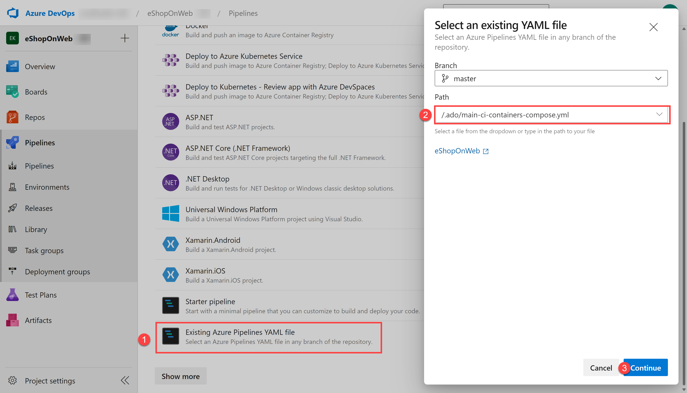
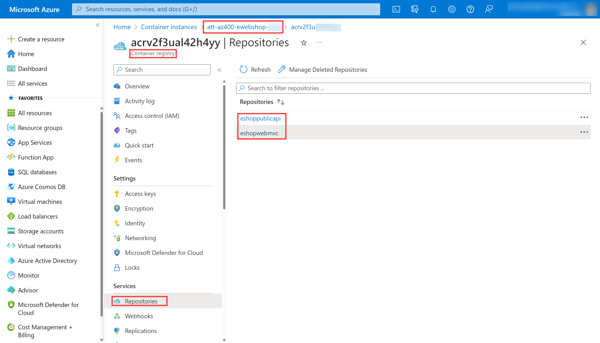

---
lab:
  title: Azure DevOps와 Azure Key Vault 통합
  module: 'Module 04: Implement a secure continuous deployment using Azure Pipelines'
---

# Azure DevOps와 Azure Key Vault 통합

## 랩 요구 사항

- 이 랩은 **Microsoft Edge** 또는 [Azure DevOps 지원 브라우저](https://learn.microsoft.com/azure/devops/server/compatibility)가 필요합니다.

- **랩 환경 유효성 검사 완료:** 이 랩을 시작하기 전에 이 랩에 필요한 Azure DevOps 조직, 프로젝트 및 서비스 연결을 설정하는 [유효성 검사 랩 환경](AZ400_M00_Validate_lab_environment.md)을 완료해야 합니다.

- **Azure DevOps 조직 설정:** 이 랩에 사용할 수 있는 Azure DevOps 조직이 아직 없으면 [조직 또는 프로젝트 컬렉션 만들기](https://learn.microsoft.com/azure/devops/organizations/accounts/create-organization)에서 제공되는 지침에 따라 조직을 만듭니다.
- 기존 Azure 구독을 확인하거나 새 구독을 만듭니다.

## 랩 개요

Azure Key Vault에서는 키, 암호, 인증서 등의 중요한 데이터를 안전하게 저장하고 관리할 수 있습니다. Azure Key Vault는 하드웨어 보안 모듈뿐 아니라 다양한 암호화 알고리즘과 키 길이를 지원합니다. Azure Key Vault를 사용하면 소스 코드를 통해 중요한 데이터가 노출될 가능성을 최소화할 수 있습니다. 이러한 데이터 노출은 개발자가 흔히 저지르는 실수 중 하나입니다. Azure Key Vault에 액세스하려면 적절한 인증과 권한 부여를 진행해야 합니다. 따라서 Azure Key Vault에 저장된 콘텐츠에 대해 세분화된 권한을 적용할 수 있습니다.

이 랩에서는 다음 단계를 수행하여 Azure Pipelines과 Azure Key Vault를 통합하는 방법을 살펴봅니다.

- ACR 암호를 비밀로 저장할 Azure Key Vault를 만듭니다.
- Azure Key Vault의 비밀에 대한 액세스 권한을 제공합니다.
- 비밀을 읽을 수 있는 권한을 구성합니다.
- Azure Key Vault에서 암호를 검색하여 후속 작업에 전달하도록 파이프라인을 구성합니다.

## 목표

이 랩을 완료하면 다음 작업을 수행할 수 있습니다.

- Azure Key Vault를 만듭니다.
- Azure DevOps 파이프라인의 Azure Key Vault에서 비밀을 검색합니다.
- 파이프라인의 후속 작업에서 비밀을 사용합니다.
- 비밀을 사용하여 컨테이너 이미지를 ACI(Azure 컨테이너 인스턴스)에 배포합니다.

## 예상 소요 시간: 40분

## 지침

### 연습 0: (완료된 경우 건너뛰기)랩 필수 구성 요소 구성

이 연습에서는 랩의 필수 구성 요소를 설정합니다. 구체적으로는 [eShopOnWeb](https://github.com/MicrosoftLearning/eShopOnWeb)을 기반으로 하여 새 Azure DevOps 프로젝트와 리포지토리를 설정합니다.

#### 작업 1: (완료된 경우 건너뛰기) 팀 프로젝트 만들기 및 구성

이 작업에서는 여러 랩에서 사용할 **eShopOnWeb** Azure DevOps 프로젝트를 만듭니다.

1. 랩 컴퓨터의 브라우저 창에서 Azure DevOps 조직을 엽니다. **새 프로젝트**를 클릭합니다. 프로젝트 이름을 **eShopOnWeb**으로 설정하고 다른 필드는 기본값으로 유지합니다. **만들기**를 클릭합니다.

    

#### 작업 2: (완료된 경우 건너뛰기) eShopOnWeb Git 리포지토리 가져오기

이 작업에서는 여러 랩에서 사용할 eShopOnWeb Git 리포지토리를 가져옵니다.

1. 랩 컴퓨터의 브라우저 창에서 Azure DevOps 조직 및 이전에 만든 **eShopOnWeb** 프로젝트를 엽니다. **Repos > Files**, **가져오기**를 클릭합니다. **Git 리포지토리 가져오기** 창에서 다음 URL <https://github.com/MicrosoftLearning/eShopOnWeb.git>을 붙여넣고 **가져오기**를 클릭합니다.

    

1. 리포지토리는 다음과 같은 방식으로 구성됩니다.
    - **.ado** 폴더에는 Azure DevOps YAML 파이프라인이 포함되어 있습니다.
    - **.devcontainer** 폴더 컨테이너 설정을 통해 컨테이너를 사용하여 개발합니다(VS Code 또는 GitHub Codespaces에서 로컬로).
    - **infra** 폴더에는 일부 랩 시나리오에서 사용되는 코드 템플릿으로 Bicep 및 ARM 인프라가 포함되어 있습니다.
    - **.github** 폴더 컨테이너 YAML GitHub 워크플로 정의.
    - **src** 폴더에는 랩 시나리오에서 사용되는 .NET 8 웹 사이트가 포함되어 있습니다.

#### 작업 3: (완료된 경우 건너뛰기) 기본(main) 분기를 기본 분기로 설정

1. **Repos > Branches**로 이동합니다.
1. **기본** 분기를 마우스로 가리킨 다음 열 오른쪽에 있는 줄임표를 클릭합니다.
1. **기본 분기로 설정**을 클릭합니다.

### 연습 1: CI 파이프라인을 설정하여 eShopOnWeb 컨테이너 빌드하기

이 연습에서는 eShopOnWeb 컨테이너 이미지를 빌드하고 ACR(Azure Container Registry)로 푸시하는 CI 파이프라인을 만듭니다. 파이프라인은 Docker Compose를 사용하여 이미지를 빌드하고 ACR에 푸시합니다.

#### 작업 1: CI 파이프라인 설정 및 실행

이 작업에서는 기존 CI YAML 파이프라인 정의를 가져오고, 수정하고, 실행합니다. 새 ACR(Azure Container Registry)을 만들고 eShopOnWeb 컨테이너 이미지를 빌드/게시합니다.

1. 랩 컴퓨터에서 웹 브라우저를 시작하고 Azure DevOps **eShopOnWeb** 프로젝트로 이동합니다. **Pipelines > Pipelines**으로 이동하여 **파이프라인 만들기**(또는 **새 파이프라인**)를 클릭합니다.

1. **코드 위치** 창에서 **Azure Repos Git(YAML)** 을 선택하고 **eShopOnWeb** 리포지토리를 선택합니다.

1. **구성** 섹션에서 **기존 Azure Pipelines YAML 파일**을 선택합니다. **기본** 분기를 선택하고 **/.ado/eshoponweb-ci-dockercompose.yml** 경로를 제공한 후 **계속**을 클릭합니다.

    

1. YAML 파이프라인 정의에서 **AZ400-EWebShop-NAME**의 **NAME**을 고유한 값으로 바꾸어 리소스 그룹 이름을 사용자 지정하고 **YOUR-SUBSCRIPTION-ID**를 사용자의 고유한 Azure subscriptionId로 바꿉니다.

1. **저장 및 실행**을 클릭하고 파이프라인이 성공적으로 실행될 때까지 기다립니다. 파이프라인 만들기 및 실행 프로세스를 완료하려면 **저장 및 실행**을 한번 더 클릭해야 할 수 있습니다.

    > **중요**: "ACI에 대한 Docker Compose 실행을 계속할 수 있으려면 이 파이프라인에 리소스에 대한 액세스 권한이 필요합니다. "라는 메시지가 표시되면 보기, 허용 및 허용을 다시 클릭합니다. 파이프라인에서 리소스를 만들 수 있도록 허용하려면 이 작업이 필요합니다. 권한 메시지를 보려면 빌드 작업을 클릭해야 합니다.

    > **참고**: 이 빌드를 완료하는 데 몇 분 정도 걸릴 수 있습니다. 빌드 정의는 다음과 같은 작업으로 구성되어 있습니다.
    - **AzureResourceManagerTemplateDeployment**는 **bicep**을 사용하여 Azure Container Registry를 배포합니다.
    - **PowerShell** 작업은 bicep 출력(acr 로그인 서버)을 가져오고 파이프라인 변수를 만듭니다.
    - **DockerCompose** 작업은 eShopOnWeb에 대한 컨테이너 이미지를 빌드하고 Azure Container Registry를 푸시합니다.

1. 파이프라인은 프로젝트 이름을 기준으로 이름을 사용합니다. 파이프라인을 더 잘 식별하기 위해 **이름을 바꿔**보겠습니다. **Pipelines > Pipelines**으로 이동하여 최근에 만든 파이프라인을 클릭합니다. 줄임표 및 **이름 바꾸기/제거** 옵션을 클릭합니다. **`eshoponweb-ci-dockercompose`** 로 이름을 지정하고 **저장**을 클릭합니다.

1. 실행이 완료되면 Azure Portal에서 이전에 정의된 리소스 그룹을 열고, 생성된 컨테이너 이미지 **eshoppublicapi** 및 **eshopwebmvc**가 있는 ACR(Azure Container Registry)을 찾아야 합니다. 배포 단계에서만 **eshopwebmvc**를 사용합니다.

    

1. **액세스 키**를 클릭하고, **관리 사용자**를 활성화하지 않았다면 활성화하고, **암호** 값을 복사합니다. 이는 Azure Key Vault에서 비밀로 유지되므로 다음 작업에서 사용됩니다.

    

#### 작업 2: Azure Key Vault 만들기

이 작업에서는 Azure Portal을 사용하여 Azure Key Vault를 만듭니다.

이 랩 시나리오에서는 ACR(Azure Container Registry)에 저장된 컨테이너 이미지를 끌어오고 실행하는 ACI(Azure Container Instance)가 있습니다. 이 ACR의 암호를 키 자격 증명 모음에 비밀로 저장하려고 합니다.

1. Azure Portal의 **리소스, 서비스 및 문서 검색** 텍스트 상자에 **`Key vault`** 입력 후 **<Enter>** 키를 누릅니다.
1. **키 자격 증명 모음** 블레이드를 선택하고 **만들기 > 키 자격 증명 모음**을 클릭합니다.
1. **키 자격 증명 모음 만들기** 블레이드의 **기본** 탭에서 다음 설정을 지정하고 **다음**을 클릭합니다.

    | 설정 | 값 |
    | --- | --- |
    | 구독 | 이 랩에서 사용 중인 Azure 구독의 이름 |
    | Resource group | 새 리소스 그룹의 이름 **AZ400-EWebShop-NAME** |
    | Key Vault 이름 | **ewebshop-kv-NAME**(NAME 바꾸기)과 같은 고유하고 유효한 이름 |
    | 지역 | 랩 환경의 위치와 가까운 Azure 지역 |
    | 가격 책정 계층 | **Standard** |
    | 삭제된 자격 증명 모음 보존 일수 | **7** |
    | 제거 보호 | **제거 보호 사용 안 함** |

1. **키 자격 증명 모음 만들기** 블레이드의 **액세스 구성** 탭에서 **자격 증명 모음 액세스 정책**을 선택한 다음 **액세스 정책** 섹션에서 **+ 만들기**를 클릭하여 새 정책을 설정합니다.

    > **참고**: 권한이 부여된 애플리케이션과 사용자에게만 액세스를 허용하는 방식으로 키 자격 증명 액세스 보안을 유지해야 합니다. 자격 증명 모음의 데이터에 액세스하려면 파이프라인의 인증에 대한 랩 환경 유효성 검사 중에 만든 서비스 연결에 대해 읽기(가져오기/나열) 권한을 제공해야 합니다.

    1. **권한** 블레이드의 **비밀 권한** 아래에서 권한 **가져오기** 및 **나열**을 선택합니다. **다음**을 클릭합니다.
    2. **보안 주체** 블레이드에서 **Azure 구독 서비스 연결**(랩 환경 유효성 검사 중에 생성된 연결, 일반적으로 "azure subs")을 검색하고 목록에서 선택합니다. Azure DevOps의 프로젝트 설정 > 서비스 연결 > azure subs > 서비스 사용자 이름 관리에서 서비스 사용자 이름을 찾을 수 있습니다. Azure 구독을 선택할 때 사용 권한 오류가 발생하는 경우 키 자격 증명 모음에서 자동으로 액세스 정책을 만드는 **권한 부여** 단추를 클릭합니다. **다음**, **다음**, **만들기**(액세스 정책)를 클릭합니다.
    3. **검토 + 만들기** 블레이드에서 **만들기**를 클릭합니다.

1. **키 자격 증명 모음 만들기** 블레이드로 돌아가서 **검토 + 만들기 > 만들기** 클릭

    > **참고**: Azure Key Vault가 프로비전될 때까지 기다립니다. 이는 1분 이내에 완료됩니다.

1. **배포가 완료됨** 블레이드에서 **리소스로 이동**을 클릭합니다.
1. Azure Key Vault(ewebshop-kv-NAME) 블레이드 왼쪽의 세로 메뉴에 있는 **개체** 섹션에서 **비밀**을 클릭합니다.
1. **비밀** 블레이드에서 **생성/가져오기**를 클릭합니다.
1. **비밀 만들기** 블레이드에서 다음 설정을 지정한 후에 **만들기**를 클릭합니다. 다른 값은 모두 기본값으로 유지합니다.

    | 설정 | 값 |
    | --- | --- |
    | 업로드 옵션 | **수동** |
    | 이름 | **acr-secret** |
    | 비밀 값 | 이전 작업에서 복사한 ACR 액세스 암호 |

#### 작업 3: Azure Key Vault에 연결된 변수 그룹 만들기

이 작업에서는 이전에 만든 서비스 연결을 사용하여 키 자격 증명 모음에서 ACR 암호 비밀을 검색하는 변수 그룹을 Azure DevOps에 만듭니다.

1. 랩 컴퓨터에서 웹 브라우저를 시작하고 Azure DevOps 프로젝트 **eShopOnWeb**으로 이동합니다.

1. Azure DevOps 포털의 세로 탐색 창에서 **Pipelines > 라이브러리**를 선택합니다. **+ 변수 그룹을** 클릭합니다.

1. **새 변수 그룹** 블레이드에서 다음 설정을 지정합니다.

    | 설정 | 값 |
    | --- | --- |
    | 변수 그룹 이름 | **eshopweb-vg** |
    | Azure Key Vault의 비밀 연결 | **enable** |
    | Azure 구독 | **사용 가능한 Azure 서비스 연결 > Azure 구독** |
    | Key Vault 이름 | 키 자격 증명 모음 이름입니다.|

1. **변수**에서 **+ 추가**를 클릭하고 **acr-secret** 비밀을 선택합니다. **확인**을 클릭합니다.
1. **Save**를 클릭합니다.

    

#### 작업 4: CD 파이프라인을 설정하여 ACI(Azure Container Instance)에서 컨테이너 배포하기

이 작업에서는 CD 파이프라인을 가져오고, 사용자 지정하고, 실행하여 이전에 만든 컨테이너 이미지를 Azure Container Instance에 배포합니다.

1. 랩 컴퓨터에서 웹 브라우저를 시작하고 Azure DevOps **eShopOnWeb** 프로젝트로 이동합니다. **Pipelines > Pipelines**으로 이동하여 **새 파이프라인**을 클릭합니다.

1. **코드 위치** 창에서 **Azure Repos Git(YAML)** 을 선택하고 **eShopOnWeb** 리포지토리를 선택합니다.

1. **구성** 섹션에서 **기존 Azure Pipelines YAML 파일**을 선택합니다. **기본** 분기를 선택하고 **/.ado/eshoponweb-cd-aci.yml** 경로를 제공한 후 **계속**을 클릭합니다.

1. YAML 파이프라인 정의에서 다음을 사용자 지정합니다.

    - **YOUR-SUBSCRIPTION-ID**를 Azure 구독 ID로 바꿉니다.
    - **az400eshop-NAME** 전역적으로 고유한 이름을 설정하려면 NAME을 바꿉니다.
    - ACR 로그인 서버가 있는 **YOUR-ACR.azurecr.io** 및 **ACR-USERNAME**(둘 다 ACR 이름이 필요하며 ACR > 액세스 키에서 확인할 수 있음).
    - **AZ400-EWebShop-NAME**, 랩에서 이전에 정의된 리소스 그룹 이름이 포함됨.

1. **저장 및 실행**을 클릭합니다. 파이프라인 만들기 및 실행 프로세스를 완료하려면 **저장 및 실행**을 한번 더 클릭해야 할 수 있습니다. 사용 권한 메시지를 보려면 빌드 작업을 클릭해야 합니다.
1. 파이프라인을 열고 성공적으로 실행되기를 기다립니다.

    > **중요**: "ACI에 대한 Docker Compose 실행을 계속할 수 있으려면 이 파이프라인에 리소스에 대한 액세스 권한이 필요합니다. "라는 메시지가 표시되면 보기, 허용 및 허용을 다시 클릭합니다. 파이프라인에서 리소스를 만들 수 있도록 허용하려면 이 작업이 필요합니다.

    > **참고**: 배포가 완료될 때까지 몇 분 정도 걸릴 수 있습니다. CD 정의는 다음과 같은 작업으로 구성되어 있습니다.
    - **리소스**: CI 파이프라인 완료 시 자동으로 트리거되도록 준비됩니다. 또한 bicep 파일에 대한 리포지토리를 다운로드합니다.
    - **변수(배포 단계용)** 는 변수 그룹에 연결하여 Azure Key Vault 비밀 **acr-secret**을 사용합니다.
    - **AzureResourceManagerTemplateDeployment**는 bicep 템플릿을 사용하여 ACI(Azure Container Instance)를 배포하며, 이전에 생성된 컨테이너 이미지를 ACI가 ACR(Azure Container Registry)에서 다운로드할 수 있도록 ACR 로그인 매개 변수를 제공합니다.

1. 파이프라인 배포 결과를 확인하려면 Azure Portal에서 **AZ400-EWebShop-NAME** 리소스 그룹을 검색하여 선택합니다. 리소스 목록에서 **az400eshop** 컨테이너 인스턴스가 파이프라인에 의해 생성되었는지 확인합니다.

1. 파이프라인은 프로젝트 이름을 기준으로 이름을 사용합니다. 파이프라인을 더 잘 식별하기 위해 **이름을 바꿔**보겠습니다. **Pipelines > Pipelines**으로 이동하여 최근에 만든 파이프라인을 클릭합니다. 줄임표 및 **이름 바꾸기/제거** 옵션을 클릭합니다. 이름을 **eshoponweb-cd-aci**로 설정하고 **저장**을 클릭합니다.

   > [!IMPORTANT]
   > 불필요한 요금이 부과되지 않도록 Azure Portal에서 만든 리소스를 삭제하는 것을 잊지 마세요.

## 검토

이 랩에서는 다음 단계를 수행하여 Azure DevOps 파이프라인과 Azure Key Vault를 통합했습니다.

- ACR 암호를 비밀로 저장하기 위해 Azure Key Vault를 만들었습니다.
- Azure Key Vault의 비밀에 대한 액세스 권한을 제공했습니다.
- 비밀을 읽을 수 있는 권한이 구성되었습니다.
- Azure Key Vault에서 암호를 검색하여 후속 작업에 전달하도록 파이프라인을 구성했습니다.
- 비밀을 사용하여 컨테이너 이미지를 ACI(Azure 컨테이너 인스턴스)에 배포니다.
- Azure Key Vault에 연결된 변수 그룹을 만들었습니다.
