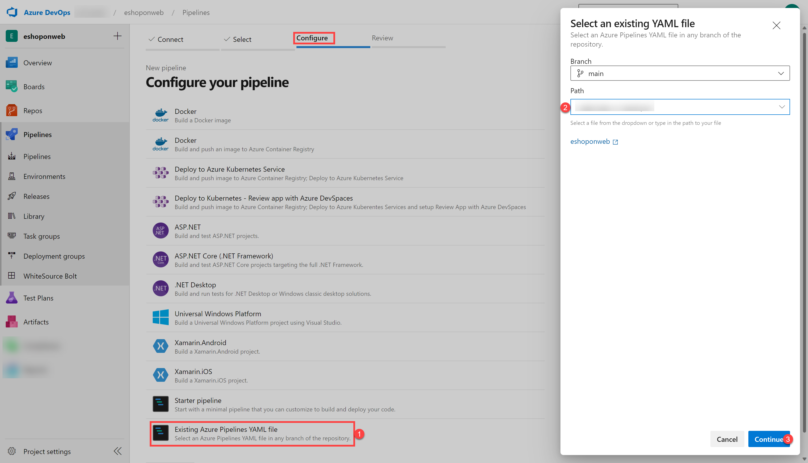

---
lab:
  title: Azure DevOps 파이프라인에서 보안 및 규정 준수 구현
  module: 'Module 07: Implement security and validate code bases for compliance'
---

# Azure DevOps 파이프라인에서 보안 및 규정 준수 구현

## 학생용 랩 매뉴얼

## 랩 요구 사항

- 이 랩은 **Microsoft Edge** 또는 [Azure DevOps 지원 브라우저](https://learn.microsoft.com/azure/devops/server/compatibility)가 필요합니다.

- **Azure DevOps 조직 설정:** 이 랩에 사용할 수 있는 Azure DevOps 조직이 아직 없으면 [조직 또는 프로젝트 컬렉션 만들기](https://learn.microsoft.com/azure/devops/organizations/accounts/create-organization)에서 제공되는 지침에 따라 조직을 만듭니다.

## 랩 개요

이 랩에서는 **Mend Bolt(이전의 WhiteSource)** 를 사용하여 취약한 오픈 소스 구성 요소, 오래된 라이브러리 및 코드의 라이선스 규정 준수 문제를 자동으로 검색합니다. 그리고 흔히 발생하는 웹 애플리케이션 보안 문제를 재현하는 데 사용할 수 있는 WebGoat를 활용합니다. OWASP에서 유지 관리하는 이 웹 애플리케이션은 의도적으로 안전하지 않게 제작되었습니다.

[Mend](https://www.mend.io/)는 지속적인 오픈 소스 소프트웨어 보안 및 규정 준수 관리 분야에서 가장 유명한 플랫폼입니다. 어떤 프로그래밍 언어, 빌드 도구, 개발 환경을 사용하든 관계없이 빌드 프로세스에 통합할 수 있습니다. 또한 백그라운드에서 계속해서 자동 작동하면서 오픈 소스 구성 요소의 보안, 라이선스 및 품질을 오픈 소스 리포지토리의 확정 데이터베이스와 대조하여 확인합니다. 이 데이터베이스는 WhiteSource에서 지속적으로 업데이트되고 있습니다.

Mend에서 제공하는 간단한 오픈 소스 보안 및 관리 솔루션인 Mend Bolt는 Azure DevOps 및 Azure DevOps Server와의 통합 전용으로 개발되었습니다. Mend Bolt는 프로젝트별로 작동하며 실시간 경고 기능은 제공하지 않습니다. 실시간 경고 기능을 사용하려면 **전체 플랫폼**이 필요합니다. 대개 모든 프로젝트 및 제품과 관련하여 리포지토리부터 배포 후 단계에 이르기까지 전체 소프트웨어 개발 수명 주기에 걸쳐 오픈 소스 관리를 자동화하려는 대규모 개발 팀의 경우 전체 플랫폼을 사용하는 것이 좋습니다.

Azure DevOps와 Mend Bolt를 통합하는 경우의 이점은 다음과 같습니다.

- 취약한 오픈 소스 구성 요소를 감지하고 해결합니다.
- 프로젝트 또는 빌드당 포괄적인 오픈 소스 인벤토리 보고서를 생성합니다.
- 종속성의 라이선스를 포함하여 오픈 소스 라이선스 준수를 적용합니다.
- 업데이트할 권장 사항을 사용하여 오래된 오픈 소스 라이브러리를 식별합니다.

## 목표

이 랩을 완료하면 다음 작업을 수행할 수 있습니다.

- Mend Bolt를 활성화합니다.
- 빌드 파이프라인을 실행하고 Mend 보안 및 규정 준수 보고서를 검토합니다.

## 예상 소요 시간: 45분

## 지침

### 연습 0: 랩 필수 구성 요소 구성

이 연습에서는 랩의 필수 구성 요소를 설정합니다. 구체적으로는 [eShopOnWeb](https://github.com/MicrosoftLearning/eShopOnWeb)을 기반으로 하여 새 Azure DevOps 프로젝트와 리포지토리를 설정합니다.

#### 작업 1: (완료된 경우 건너뛰기) 팀 프로젝트 만들기 및 구성

이 작업에서는 여러 랩에서 사용할 **eShopOnWeb** Azure DevOps 프로젝트를 만듭니다.

1. 랩 컴퓨터의 브라우저 창에서 Azure DevOps 조직을 엽니다. **새 프로젝트**를 클릭합니다. 프로젝트 이름을 **eShopOnWeb**으로 설정하고 다른 필드는 기본값으로 유지합니다. **만들기**를 클릭합니다.

    

#### 작업 2: (완료된 경우 건너뛰기) eShopOnWeb Git 리포지토리 가져오기

이 작업에서는 여러 랩에서 사용할 eShopOnWeb Git 리포지토리를 가져옵니다.

1. 랩 컴퓨터의 브라우저 창에서 Azure DevOps 조직 및 이전에 만든 **eShopOnWeb** 프로젝트를 엽니다. **Repos > 파일**, **가져오기**를 클릭합니다. **Git 리포지토리 가져오기** 창에서 다음 URL https://github.com/MicrosoftLearning/eShopOnWeb.git 을 붙여넣고 **가져오기**를 클릭합니다.

    

2. 리포지토리는 다음과 같은 방식으로 구성됩니다.
    - **.ado** 폴더에는 Azure DevOps YAML 파이프라인이 포함되어 있습니다.
    - 컨테이너를 사용하여 개발하는 **.devcontainer** 폴더 컨테이너 설정(VS Code 또는 GitHub Codespaces에서 로컬로).
    - **.azure** 폴더에는 일부 랩 시나리오에서 사용되는 코드 템플릿으로 Bicep&ARM 인프라가 포함되어 있습니다.
    - **.github** 폴더 컨테이너 YAML GitHub 워크플로 정의.
    - **src** 폴더에는 랩 시나리오에서 사용되는 .NET 6 웹 사이트가 포함되어 있습니다.

### 연습 1: Mend Bolt를 사용하여 Azure DevOps 파이프라인에서 보안 및 규정 준수 구현

이 연습에서는 Mend Bolt를 활용하여 프로젝트 코드를 검사해 보안 취약성 및 라이선스 규정 준수 문제가 있는지를 파악하고 결과로 작성된 보고서를 확인합니다.

#### 작업 1: Mend Bolt 확장 활성화

이 작업에서는 새로 생성된 Azure DevOps 프로젝트에서 WhiteSource Bolt를 활성화합니다.

1. 랩 컴퓨터의 **eShopOnWeb** 프로젝트가 열려 있는 Azure DevOps 포털이 표시된 웹 브라우저 창에서 Marketplace 아이콘 > **Marketplace 찾아보기**를 클릭합니다.

    

2. Marketplace에서 **Mend Bolt(이전의 WhiteSource)** 를 검색하여 엽니다. Mend Bolt는 이전에 출시된 WhiteSource 도구의 무료 버전으로, 모든 프로젝트를 검사하고 오픈 소스 구성 요소, 라이선스 및 알려진 취약성을 감지합니다.

    > 경고: Mend **Bolt** 옵션(**무료** 옵션)을 선택해야 합니다.

3. **Mend Bolt(이전의 WhiteSource)** 페이지에서 **무료로 다운로드**를 클릭합니다.

    

4. 다음 페이지에서 원하는 Azure DevOps 조직 및 **설치**를 선택합니다. 설치가 완료되면 **조직으로 이동**합니다.

5. Azure DevOps에서 **조직 설정**으로 이동하고 **확장** 아래에서 **Mend**를 선택합니다. 회사 이메일(**랩 개인 계정**, 예를 들어 student@microsoft.com 대신 AZ400learner@outlook.com 사용), 회사 이름 및 기타 세부 정보를 제공하고 **계정 만들기** 단추를 클릭하여 무료 버전 사용을 시작합니다.

    

#### 작업 2: 빌드 만들기 및 트리거

이 작업에서는 Azure DevOps 프로젝트 내에서 CI 빌드 파이프라인을 만들고 트리거합니다. 그리고 **Mend Bolt** 확장을 사용하여 이 코드에 취약한 OSS 구성 요소가 있는지 확인합니다.

1. 랩 컴퓨터의 **eShopOnWeb** Azure DevOps 프로젝트의 왼쪽 세로 메뉴 모음에서 **파이프라인 > 파이프라인** 섹션으로 이동한 후 **파이프라인 만들기**(또는 **새 파이프라인**)를 클릭합니다.

2. **코드 위치** 창에서 **Azure Repos Git(YAML)** 을 선택하고 **eShopOnWeb** 리포지토리를 선택합니다.

3. **구성** 섹션에서 **기존 Azure Pipelines YAML 파일**을 선택합니다. 경로 **/.ado/eshoponweb-ci-mend.yml**을 제공하고 **계속**을 클릭합니다.

    

4. 파이프라인을 검토하고 **실행**을 클릭합니다. 성공적으로 실행하는 데 몇 분 정도 걸립니다.
    > **참고**: 이 빌드를 완료하는 데 몇 분 정도 걸릴 수 있습니다. 빌드 정의는 다음과 같은 작업으로 구성되어 있습니다.
    - dotnet 프로젝트를 복원, 빌드, 테스트, 게시하기 위한 **DotnetCLI** 작업입니다.
    - OSS 라이브러리의 Mend 도구 분석을 실행하기 위한 **Whitesource** 작업(이전 이름 계속 유지)입니다.
    - **아티팩트 게시** 이 파이프라인을 실행 중인 에이전트는 게시된 웹 프로젝트를 업로드합니다.

5. 파이프라인이 실행 중인 동안 **이름을 바꾸면** 더 쉽게 식별할 수 있습니다(프로젝트가 여러 랩에 사용될 수 있음). Azure DevOps 프로젝트의 **파이프라인/파이프라인** 섹션으로 이동하여 실행 중인 파이프라인 이름을 클릭하고(기본 이름을 가져옴), 줄임표 아이콘에서 **이름 바꾸기/이동** 옵션을 찾습니다. 이름을 **eshoponweb-ci-mend**로 바꾸고 **저장**을 클릭합니다.

    

6. 파이프라인 실행이 완료되면 결과를 검토할 수 있습니다. **eshoponweb-ci-mend** 파이프라인의 최신 실행 기록을 엽니다. 요약 탭에는 사용된 리포지토리 버전(커밋), 트리거 유형, 게시된 아티팩트, 테스트 검사 등과 같은 관련 세부 정보와 함께 실행 로그가 표시됩니다.

7. **Mend Bolt** 탭에서 OSS 보안 분석을 검토할 수 있습니다. 여기에서는 사용된 인벤토리, 발견된 취약성(및 취약성 해결 방법), 라이브러리 관련 라이선스에 대한 흥미로운 보고서의 세부 정보를 보여 줍니다. 보고서를 검토하려면 어느 정도 시간이 소요됩니다.

    

## 검토

이 랩에서는 **Mend Bolt와 Azure DevOps**를 사용하여 취약한 오픈 소스 구성 요소, 오래된 라이브러리 및 코드의 라이선스 규정 준수 문제를 자동으로 검색합니다.
