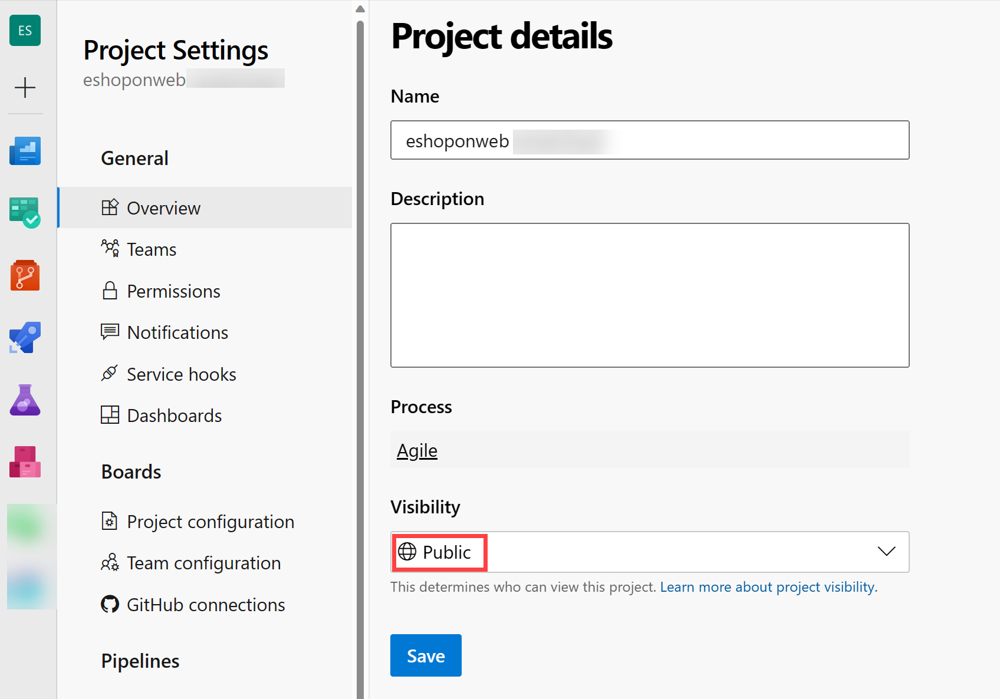
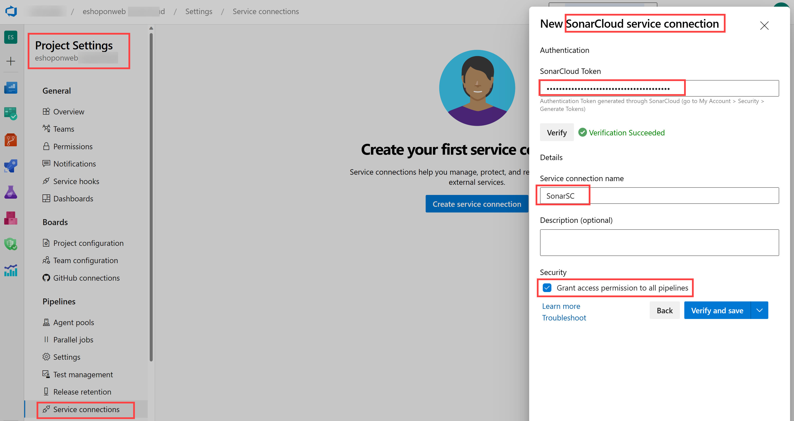

---
lab:
  title: SonarCloud 및 Azure DevOps를 사용하여 기술적인 문제 관리
  module: 'Module 07: Implement security and validate code bases for compliance'
---

# SonarCloud 및 Azure DevOps를 사용하여 기술적인 문제 관리

## 학생용 랩 매뉴얼

## 랩 요구 사항

- 이 랩은 **Microsoft Edge** 또는 [Azure DevOps 지원 브라우저](https://docs.microsoft.com/azure/devops/server/compatibility)가 필요합니다.

- **Azure DevOps 조직 설정:** 이 랩에 사용할 수 있는 Azure DevOps 조직이 아직 없으면 [조직 또는 프로젝트 컬렉션 만들기](https://docs.microsoft.com/azure/devops/organizations/accounts/create-organization)에서 제공되는 지침에 따라 조직을 만듭니다.

## 랩 개요

Azure DevOps 맥락에서 **기술 부채**란 전술 목표 달성을 위해 사용하는 방법이 가장 효율적이지 않다는 의미입니다. 이러한 문제가 발생하면 소프트웨어 개발 및 배포의 전략 목표를 달성하기가 어려워집니다. 기술적인 문제가 발생하면 생산성이 저하될 수밖에 없습니다. 코드를 파악하기가 힘들고 오류 발생 가능성이 높아질 뿐 아니라, 코드 변경 시간이 오래 걸리고 코드의 유효성을 검사하기도 어려워지기 때문입니다. 기술적인 문제는 적절하게 관리 감독하지 않으면 계속 누적될 수 있습니다. 그러면 장기적으로는 소프트웨어의 전반적인 품질과 개발 팀의 생산성도 크게 낮아집니다.

[SonarCloud](https://sonarcloud.io/){:target="\_blank"}는 클라우드 기반 코드 품질 및 보안 서비스입니다. SonarCloud에서 제공하는 주요 기능은 다음과 같습니다.

- Java, JS, C#, C/C++, Objective-C, TypeScript, Python, ABAP, PLSQL, T-SQL 등의 23개 프로그래밍/스크립팅 언어 지원.
- 효율적인 정적 코드 분석기를 기반으로 하여 찾아내기 어려운 버그와 품질 이슈를 추적할 수 있는 수천 가지 규칙 제공.
- Travis, Azure DevOps, BitBucket, AppVeyor 등 널리 사용되고 있는 CI 서비스와의 클라우드 기반 통합 기능
- 분기와 끌어오기 요청의 모든 소스 파일을 살펴볼 수 있는 심층 코드 분석 기능. 이 분석을 수행하면 품질 게이트를 통과하고 빌드의 품질 수준을 높일 수 있습니다.
- 우수한 속도와 확장성

이 랩에서는 Azure DevOps를 SonarCloud와 통합하는 방법을 알아봅니다.

> **참고**: 이 랩을 실행하려면 Azure Pipelines를 실행할 수 있어야 합니다. 2021년 2월에 수행된 퍼블릭 프로젝트의 변경으로 인해 파이프라인에 대한 액세스를 요청해야 합니다. <https://devblogs.microsoft.com/devops/change-in-azure-pipelines-grant-for-public-projects/> 

## 목표

이 랩을 완료하면 다음 작업을 수행할 수 있습니다.

- SonarCloud와 통합할 Azure DevOps 프로젝트 및 CI 빌드 설정.
- SonarCloud 보고서 분석.
- Azure DevOps 끌어오기 요청 프로세스에 정적 분석 기능 통합.

## 예상 소요 시간: 60분

## Instructions

### 연습 0: 랩 필수 구성 요소 구성

이 연습에서는 랩의 필수 구성 요소를 설정합니다. 구체적으로는 [eShopOnWeb](https://github.com/MicrosoftLearning/eShopOnWeb)을 기반으로 하여 새 Azure DevOps 프로젝트와 리포지토리를 설정합니다.

#### 작업 1: (완료된 경우 건너뛰기) 팀 프로젝트 만들기 및 구성

이 작업에서는 여러 랩에서 사용할 **eShopOnWeb** Azure DevOps 프로젝트를 만듭니다.

1. 랩 컴퓨터의 브라우저 창에서 Azure DevOps 조직을 엽니다. **새 프로젝트**를 클릭합니다. 프로젝트 이름을 **eShopOnWeb**으로 설정하고 **작업 항목 프로세스** 드롭다운에서 **스크럼**을 선택합니다. **만들기**를 클릭합니다.

    

#### 작업 2: (완료된 경우 건너뛰기) eShopOnWeb Git 리포지토리 가져오기

이 작업에서는 여러 랩에서 사용할 eShopOnWeb Git 리포지토리를 가져옵니다.

1. 랩 컴퓨터의 브라우저 창에서 Azure DevOps 조직 및 이전에 만든 **eShopOnWeb** 프로젝트를 엽니다. **Repos > 파일**, **가져오기**를 클릭합니다. **Git 리포지토리 가져오기** 창에서 다음 URL <https://github.com/MicrosoftLearning/eShopOnWeb.git>을 붙여넣고 **가져오기**를 클릭합니다.

    

1. 리포지토리는 다음과 같은 방식으로 구성됩니다.
    - **.ado** 폴더에는 Azure DevOps YAML 파이프라인이 포함되어 있습니다.
    - **.devcontainer** 폴더 컨테이너 설정을 통해 컨테이너를 사용하여 개발합니다(VS Code 또는 GitHub Codespaces에서 로컬로).
    - **infra** 폴더에는 일부 랩 시나리오에서 사용되는 코드 템플릿으로 Bicep 및 ARM 인프라가 포함되어 있습니다.
    - **.github** 폴더 컨테이너 YAML GitHub 워크플로 정의.
    - **src** 폴더에는 랩 시나리오에서 사용되는 .NET 8 웹 사이트가 포함되어 있습니다.

### 연습 1: SonarCloud 설정 구성

#### 작업 1: Azure DevOps 프로젝트를 공용으로 변경

SonarCloud가 공용 ADO 프로젝트에 무료이므로 이 작업에서는 Azure DevOps 프로젝트의 표시 유형을 공용으로 변경합니다.

1. 랩 컴퓨터의 Azure DevOps 포털이 표시된 웹 브라우저 창에서 **eShopOnWeb** 프로젝트를 열고 왼쪽 아래 모서리에 있는 **프로젝트 설정**을 클릭합니다. **표시 유형**을 **공용**으로 변경합니다. 페이지 맨 아래에 있는 **저장**



#### 작업 2: Azure DevOps 개인용 액세스 토큰 생성

이 작업에서는 Azure DevOps 개인용 액세스 토큰을 생성합니다. 이 연습의 다음 작업에서 설치할 Postman 앱에서 인증을 할 때 이 토큰을 사용합니다.

1. 랩 컴퓨터의 Azure DevOps 포털이 표시된 웹 브라우저 창에서 Azure DevOps 페이지 오른쪽 위의 **사용자 설정** 아이콘을 클릭합니다. 그런 다음 드롭다운 메뉴에서 **개인용 액세스 토큰**을 클릭하고 **개인용 액세스 토큰** 창에서 **+ 새 토큰**을 클릭합니다.

    

1. **새 개인용 액세스 토큰 만들기** 창에서 **모든 범위 표시** 링크를 클릭하고 다음 설정을 지정한 후에 **만들기**를 클릭합니다. 다른 값은 모두 기본값으로 유지합니다.

     | 설정 | 값 |
     | --- | --- |
     | 속성 | **SonarCloud 및 Azure DevOps를 사용하여 기술적인 문제 관리 랩** |
     | 범위 | **사용자 정의** |
     | 범위 | ‘코드’**** |
     | 사용 권한 | **전체**
           |

1. **성공** 창에서 개인용 액세스 토큰의 값을 클립보드에 붙여넣습니다.

     > **참고**: 토큰의 값을 적어 두세요. 이 창을 닫으면 토큰을 검색할 수 없습니다.

1. **성공** 창에서 **닫기**를 클릭합니다.

#### 작업 3: SonarCloud Azure DevOps 확장 설치 및 구성

이 작업에서는 Azure DevOps 프로젝트에서 SonarCloud Azure DevOps 확장을 설치하고 구성합니다.

1. 랩 컴퓨터에서 웹 브라우저를 시작하고 Visual Studio Marketplace의 [SonarCloud 확장 페이지](https://marketplace.visualstudio.com/items?itemName=SonarSource.sonarcloud)로 이동하여 **무료로 얻기**를 클릭합니다. **Azure Devops 조직 선택** 드롭다운 목록에 Azure DevOps 조직 이름이 표시되어 있는지 확인하고 **설치**를 클릭합니다.
1. 설치가 완료되면 **조직으로 이동**을 클릭합니다. 그러면 조직 홈 페이지가 표시된 Azure DevOps 포털로 브라우저가 리디렉션됩니다.

    > **참고**: Marketplace에서 확장을 설치하는 데 적합한 권한이 없으면 설치 승인 요청이 계정 관리자에게 전송됩니다.

    > **참고**: SonarCloud 확장에는 빌드 작업, 빌드 템플릿 및 사용자 지정 대시보드 위젯이 포함되어 있습니다.

1. 웹 브라우저 창에서 **SonarCloud 홈페이지** [https://sonarcloud.io/](https://sonarcloud.io/)로 이동합니다.
1. SonarCloud 홈 페이지에서 **로그인**을 클릭합니다.
1. **SonarCloud에 로그인 또는 등록**에서 **Azure DevOps** 옵션을 클릭합니다.
1. **이 앱이 정보에 액세스하도록 허용하시겠습니까?** 메시지가 표시되면 **예**를 클릭합니다. 메시지가 표시되면 **조직 대신 동의** 및 **동의**를 선택합니다.

    > **참고**: SonarCloud에서는 조직을 만든 후 해당 조직 내에 새 프로젝트를 만듭니다. SonarCloud에서 설정하는 조직과 프로젝트에는 Azure DevOps에서 설정한 조직과 프로젝트가 미러링됩니다.

1. **Azure에서 조직 가져오기**를 클릭합니다.

    

1. **조직 만들기** 페이지의 **Azure DevOps 조직 이름** 텍스트 상자에 Azure DevOps 조직의 이름을 입력하고, **개인용 액세스 토큰** 텍스트 상자에 이전 작업에 기록한 Azure DevOps 토큰의 값을 붙여넣은 다음 **계속**을 클릭합니다. **이 토큰은 Sonarcloud에서 Azure DevOps에 호스트되는 코드를 분석하는 데 사용됨**

1. **조직 세부 정보 가져오기** 섹션의 **키** 텍스트 상자에 Sonarcloud 조직을 지정하는 문자열을 입력하고 Azure DevOps 조직과 동일한 이름을 지정한 다음 **계속**을 클릭합니다.

    > **참고**: 키는 SonarCloud 내에서 고유해야 합니다. **키** 텍스트 상자 오른쪽에 녹색 확인 표시가 나타나는지 확인합니다. 이 표시가 나타나면 키가 고유성 관련 필수 조건을 충족하는 것입니다.

1. **플랜 선택** 섹션에서 이 랩에 사용할 플랜을 선택하고(**무료** 권장) **조직 만들기**를 클릭합니다.

    > **참고**: 그러면 Azure DevOps 조직을 미러링하는 SonarCloud 조직이 작성됩니다.

    > **참고**: 다음으로, 새로 만든 조직 내에서 Azure DevOps 프로젝트 **SonarExamples**를 미러링하는 SonarCloud 프로젝트를 만듭니다.

1. **분석 프로젝트 - 리포지토리 선택** 페이지의 Azure DevOps 프로젝트 목록에서 **eshoponweb/eshoponweb** 항목 옆의 확인란을 선택하고 **설정**을 클릭합니다.
1. **분석 방법 선택** 페이지에서 **Azure DevOps Pipelines 사용** 타일을 클릭합니다.

    

    > **참고**: 확장을 이미 설치했으면 확장 만들기를 건너뛰어도 됩니다.

1. **Azure Pipelines로 프로젝트 분석** 페이지의 **새 Sonarcloud 서비스 엔드포인트 추가**에서 **Azure DevOps 프로젝트**에 언급된 단계를 수행하고, 서비스 연결에 **SonarSC** 이름을 지정합니다. 모든 파이프라인에 대한 액세스 권한을 부여하기 확인란을 **선택**하고 **확인 및 저장**을 클릭합니다.

    

    > **참고**: 이 단계에서는 Azure Pipeline이 Sonarcloud와 통신하는 방법을 정의합니다. Sonarcloud는 파이프라인에서 서비스와 통신하는 데 사용하는 토큰을 제공합니다.

1. 랩 컴퓨터의 **eShopOnWeb** Azure DevOps 프로젝트의 왼쪽 세로 메뉴 모음에서 **파이프라인 > 파이프라인** 섹션으로 이동한 후 **파이프라인 만들기**(또는 **새 파이프라인**)를 클릭합니다.

1. **코드 위치** 창에서 **Azure Repos Git(YAML)** 을 선택하고 **eShopOnWeb** 리포지토리를 선택합니다.

1. **구성** 섹션에서 **기존 Azure Pipelines YAML 파일**을 선택합니다. **기본** 분기를 선택하고 **/.ado/eshoponweb-sonar-ci.yml** 경로를 제공한 후 **계속**을 클릭합니다. 다음 단계에서 설명한 세부 정보로 파이프라인 검토 **(일부 설정을 바꿔야 함)**

1. Sonarcloud 웹 사이트로 돌아가서 **Azure Pipelines로 프로젝트 분석** 페이지의 **Azure Pipelines 구성** 섹션에서 **.NET**을 클릭합니다. 그러면 **분석 구성 준비**, **Code Analysis 실행** 및 **품질 게이트 결과 게시** 작업에서 수행해야 하는 일련의 단계가 표시됩니다. **이전 단계에서 제공한 YAML 파이프라인에서 "분석 구성 준비" 작업을 수정**하려면 이러한 지침이 필요합니다.

1. 파이프라인이 수정되면 **실행**을 클릭합니다.

    

1. 에이전트가 파이프라인을 실행하도록 하려면 Azure DevOps 프로젝트 **표시 유형**을 다시 **비공개**로 변경해야 할 수 있습니다(Project 설정 > 개요).

1. Azure DevOps **Pipelines > Pipelines**에서 최근에 만든 파이프라인을 클릭하고 이름을 **eshoponweb-sonar-ci**로 바꿉니다.

    

#### 작업 3: 파이프라인 결과 확인

이 작업에서는 파이프라인 결과를 확인합니다.

1. 파이프라인 실행이 완료되기를 기다렸다가 **요약** 탭의 내용을 검토한 다음 **확장** 탭 헤더를 클릭합니다.

    > **참고**: 아직 Sonarcloud에서 설정하지 않았기 때문에 품질 게이트 정보(없음)가 없습니다.

1. **확장** 탭에서 **자세한 SonarCloud 보고서**를 클릭합니다. 그러면 새 브라우저 탭이 자동으로 열리고 SonarCloud 프로젝트 페이지의 보고서가 표시됩니다.

    > **참고**: SonarCloud 프로젝트로 이동할 수도 있습니다.

1. 보고서에 품질 게이트 결과가 포함되어 있지 않음을 확인하고 결과가 없는 이유를 살펴봅니다.

    > **참고**: 품질 게이트 결과를 확인하려면 첫 번째 보고서를 실행한 후에 **새 코드 정의**를 설정해야 합니다. 이렇게 하면 후속 파이프라인 실행 시에는 품질 게이트 결과가 포함됩니다. **기본 품질 게이트는 코드에 새로운 취약성/버그가 없는지 확인하고 기존 취약성을 무시합니다. 나만의 사용자 정의 품질 게이트를 만들 수도 있습니다.**

1. **새 코드 정의 설정**을 클릭하고 **이전 버전**을 선택합니다.

    

1. 최신 빌드 실행을 사용하여 **Azure DevOps 포털**의 웹 브라우저로 전환하고 **새 실행**을 클릭한 다음 **실행 파이프라인** 창에서 **실행**클릭합니다.
1. 빌드 실행 창에서 **요약** 탭의 내용을 검토하고 **확장** 탭 머리글을 클릭합니다.
1. **확장** 탭에서 **자세한 SonarCloud 보고서**를 클릭합니다. 그러면 새 브라우저 탭이 자동으로 열리고 SonarCloud 프로젝트 페이지의 보고서가 표시됩니다.
1. 이제 보고서 및 Azure DevOps **확장** 탭에 **품질 게이트 결과가 포함되어 있는지** 확인합니다.

    

### 연습 2: SonarCloud 보고서 분석

이 연습에서는 SonarCloud 보고서를 분석합니다.

#### 작업 1: SonarCloud 보고서 분석

이 작업에서는 SonarCloud 보고서를 분석합니다.

1. SonarCloud 프로젝트의 **개요** 탭에 **기본 분기 진화** 보고서에 대한 요약이 표시됩니다. **주 분기** 아이콘(왼쪽 열)을 클릭하고 **전체 코드**를 선택하면 더 자세한 보고서가 표시됩니다.

    

    > **참고**: 이 페이지에는 **코드 스멜**, **범위**, **중복** 및 **크기**(코드 줄) 등의 다른 메트릭도 있습니다. 아래 표에 이러한 각 용어의 간략한 설명이 나와 있습니다.

    | 용어 | 설명 |
    | --- | --- |
    | **버그** | 코드의 오류를 나타내는 문제입니다. 코드가 아직 손상되지 않았으면 최악의 상황에서 손상될 가능성이 높다는 의미입니다. 따라서 코드를 수정해야 합니다. |
    | **취약성** | 공격자가 악용 가능한 백도어를 나타내는 보안 관련 문제입니다. |
    | **코드 스멜(Code Smell)** | 코드 유지 관리 관련 문제입니다. 이 문제를 방치하면 유지 관리 담당자가 후속 변경을 수행할 때 평소보다 작업이 더 어려워집니다. 그리고 최악의 경우에는 코드 상태를 혼동하여 변경 시에 오류를 추가로 생성할 수도 있습니다. |
    | **적용 범위** | 단위 테스트 등의 테스트에서 유효성을 검사하는 코드 비율을 나타냅니다. 버그를 효율적으로 방지하려면 이러한 테스트에서 대부분의 코드를 실행해 보거나 검사해야 합니다. |
    | **중복** | 중복 메트릭에는 소스 코드에서 중복된 부분이 표시됩니다. |
    | **보안 핫스폿** | 취약성 유무를 평가하기 위해 수동 검토가 필요한 보안 중요 코드 |

1. **버그** 수를 지정하는 숫자를 클릭합니다. 그러면 **문제** 탭 내용이 자동으로 표시됩니다.
1. **문제** 탭의 오른쪽을 클릭하여 버그를 엽니다. 버그를 분석하고 해결하기 위해 제공된 설명과 정보를 읽습니다.

1. 코드와 줄 번호 사이에 있는 빨간 세로선 위에 마우스 포인터를 가져가 코드 검사의 간격을 파악합니다.

    > **참고**: 샘플 프로젝트는 매우 작으므로 기록 데이터가 없습니다. [SonarCloud에서 제공되는 수천 가지 공용 프로젝트](https://sonarcloud.io/explore/projects)에서 유용한 실제 결과를 확인할 수 있습니다.

### 연습 3: SonarCloud와 Azure DevOps 끌어오기 요청 통합 구현

이 연습에서는 Azure DevOps와 SonarCloud 간의 끌어오기 요청 통합을 설정합니다.

> **참고**: Azure DevOps 끌어오기 요청에 포함된 코드 분석을 수행하도록 SonarCloud 분석을 구성하려면 다음 작업을 수행해야 합니다.

- SonarCloud 프로젝트에 Azure DevOps 개인용 액세스 토큰을 추가합니다. 이 토큰을 통해 SonarCloud에 끌어오기 요청 액세스 권한이 부여됩니다(이 랩에서 이미 생성됨).
- 끌어오기 요청에서 트리거된 빌드를 제어하는 Azure DevOps 분기 정책을 구성합니다.

#### 작업 1: SonarCloud에서 끌어오기 요청 통합 구성

이 작업에서는 SonarCloud 프로젝트에 Azure DevOps 개인용 액세스 토큰을 할당하여 SonarCloud에서 끌어오기 요청 통합을 구성합니다.

1. **SonarCloud**에서 **eShopOnWeb**프로젝트를 표시하는 웹 브라우저 창으로 전환합니다.
1. 프로젝트 대시보드 페이지에서 **관리** 탭 아이콘을 클릭하고 드롭다운 메뉴에서 **일반 설정**을 클릭합니다.
1. **일반 설정** 페이지에서 **끌어오기 요청**을 클릭합니다.
1. **끌어오기 요청** 설정의 **일반** 섹션에 있는 **공급자** 드롭다운 목록에서 **Azure DevOps Services**를 선택하고 **저장**을 클릭합니다.
1. **끌어오기 요청** 설정의 **Azure DevOps Services와 통합** 섹션에 있는 **개인용 액세스 토큰** 텍스트 상자에 앞에서 생성한 Azure DevOps 개인용 액세스 토큰을 붙여넣고 **저장**을 클릭합니다.

    

#### 작업 2: SonarCloud와의 통합을 위한 분기 정책 구성

이 작업에서는 SonarCloud와의 통합을 위한 Azure DevOps 분기 정책을 구성합니다.

1. **Azure DevOps 포털**의 **eShopOnWeb** 프로젝트를 표시하는 웹 브라우저 창으로 전환합니다.
1. Azure DevOps 포털 맨 왼쪽의 세로 메뉴 모음에 있는 **Repos**를 클릭하고 **Repos** 섹션에서 **분기**를 클릭합니다.
1. **분기** 창의 분기 목록에서 **기본** 분기 항목 오른쪽 모서리 위에 마우스 포인터를 가져가면 **추가 옵션** 메뉴를 나타내는 세로 줄임표 문자가 표시됩니다. 이 문자를 클릭하고 팝업 메뉴에서 **분기 정책**을 클릭합니다.
1. **기본** 창에서 **빌드 유효성 검사** 오른쪽에 있는 **+** 을(를) 클릭합니다.
1. **빌드 정책 추가** 창의 **빌드 파이프라인** 드롭다운 목록에서 이 작업 앞부분에서 만든 파이프라인을 선택하고 **표시 이름**에는 **SonarCloud 분석**을 입력한 후에 **저장**을 클릭합니다.

    > **참고**: 이제 **기본** 분기를 대상으로 하는 끌어오기 요청을 작성하면 Azure DevOps가 SonarCloud 분석을 트리거하도록 구성되었습니다.

#### 작업 4: 끌어오기 요청 통합 유효성 검사

이 작업에서는 끌어오기 요청을 만들고 결과를 검토하여 Azure DevOps와 SonarCloud 간의 끌어오기 요청 통합 유효성을 검사합니다.

> **참고**: 리포지토리의 파일을 변경하고 SonarCloud 분석을 트리거하는 요청을 작성해야 합니다.

1. Azure DevOps 포털 왼쪽의 세로 메뉴 모음에 있는 **Repos**를 클릭합니다. 그러면 **파일** 창이 표시됩니다.
1. 중앙 창의 폴더 계층 구조에서 **src/Web/Services/BasketViewModelService.cs** 폴더의 **Program.cs** 파일로 이동하고 **편집**을 클릭합니다.
1. **BasketViewModelService.cs** 창에서 마지막 "}" 바로 앞에 다음 빈 메서드를 코드에 추가합니다.

    ```csharp
    public void Unused(){

    }
    ```

1. **Program.cs** 창에서 **커밋**을 클릭합니다.
1. **커밋** 창의 **분기 이름** 텍스트 상자에 **branch1**을 입력하고 **끌어오기 요청 만들기** 확인란을 선택한 다음 **커밋**을 클릭합니다.

    

1. **새 끌어오기 요청** 창에서 **만들기**를 선택합니다.
1. **업데이트된 Program.cs** 창의 **개요** 탭에서 빌드 프로세스가 완료될 때까지 진행률을 모니터링합니다.
1. 파이프라인은 성공하지만 1개의 선택적 검사가 실패합니다.
1. 또한 Sonarcloud는 권장되지 않은 최근 사용자 사례에 대한 의견으로 PR을 데코레이트합니다. 또한 Sonarcloud의 전체 보고서에서 자세한 내용을 검토할 수 있습니다.

     

#### 작업 4: 실패하는 코드 품질 검사에 대응하여 끌어오기 요청 차단

이 작업에서는 실패하는 코드 품질 검사에 대응하여 끌어오기 요청 차단을 구성합니다.

> **참고**: 이 시점에서는 코드 품질 검사가 실패해도 끌어오기 요청을 완료하고 해당 변경 내용을 커밋할 수 있습니다. 여기서는 관련 코드 품질 검사에 통과하지 않으면 커밋을 차단하도록 Azure DevOps 구성을 수정합니다.

1. Azure Devops 페이지의 왼쪽 아래 모서리에서 **프로젝트 설정**을 선택합니다.
1. **프로젝트 설정** 세로 메뉴의 **Repos** 섹션에서 **리포지토리**를 클릭합니다.
1. **모든 리포지토리** 창에서 **eShopOnWeb**을 클릭합니다.
1. **eShopOnWeb** 창에서 **정책** 탭 머리글을 클릭합니다.
1. **정책** 목록에서 아래쪽의 분기 목록으로 스크롤하여 **기본** 분기를 나타내는 항목을 클릭합니다.
1. **기본** 창에서 아래쪽으로 **상태 검사** 섹션으로 스크롤하여 **+** 를 클릭합니다.
1. **상태 정책 추가** 창의 **확인할 상태** 드롭다운 목록에서 **SonarCloud/품질 게이트** 항목을 선택하고 **정책 요구 사항** 옵션이 **필수**로 설정되어 있는지 확인한 후 **저장**을 클릭합니다.

    > **참고**: 이 시점이 되면 사용자는 **코드 품질 검사가 성공할 때까지 끌어오기 요청을 병합할 수 없습니다**. 즉, 해당하는 SonarCloud 프로젝트에서 SonarCloud가 식별한 모든 문제를 해결하거나 **확인됨** 또는 **해결됨**으로 표시해야 합니다.

## 검토

이 랩에서는 SonarCloud와 Azure DevOps Services를 통합하는 방법을 알아보았습니다.
